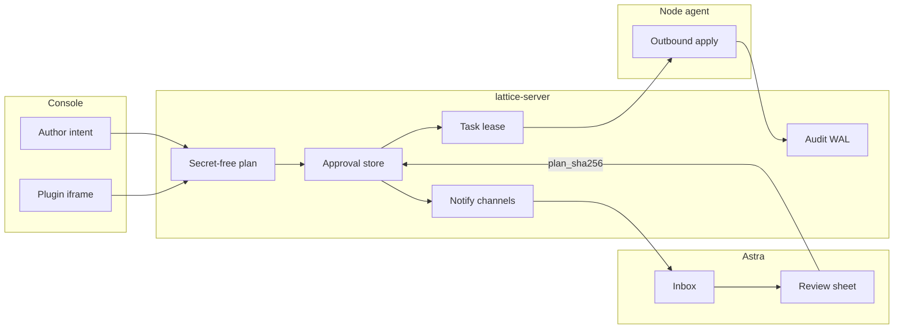

# design-21: Astra as the phone approval device

Status: proposed 2026-09-09. Doctrine: [`../PRODUCT-VISION.md`](../PRODUCT-VISION.md)
section 5 (Astra exists so an operator can review and approve a plan in under a
minute from anywhere). The 2026-06 five-tab chassis is recorded in
[`../iterations/iter-062-astra-ios-control-companion.md`](../iterations/iter-062-astra-ios-control-companion.md);
this design replaces that identity. Production versions stay in the operator's
program log. KI-14 in that log updates only when a slice ships.

Astra is the same Lattice product as the Vue console, on a phone. It is not a
second console. Plugin iframes, Terminal, Store, Publishing, DNS, policy
authoring, knock reveal, and credential rotation stay on the web. The public
site already describes Astra as source plus CI; that distribution status does
not change here. Signing, TestFlight, and APNs remain operator decisions.

## Outcome

One operator, the same identity as the console, interrupted on a phone: pocket,
one hand, glance, cellular. A pending plan is understood, hash-bound, and
approved, rejected, or dismissed in under a minute. A red fleet fact is
understood in a few glances. Reject is first-class. Dismiss is offered where
the server will honour it. Approve is never the only button. "Open on web" is
always available.

The essential path is push or badge, Inbox, the plan that was shown,
`plan_sha256` bound to the bytes on screen, Face ID confirm, server queues
apply, audit. The iPhone app is a client of `lattice-server`. Bark, already a
Lattice notify channel, is the interrupt path. The node agent never talks to
the phone.

iOS will not deliver the unattended week by polling. Server notify is the
alerter. Astra is the reviewer.

## Axioms applied

Axiom 1 is the Review sheet: approval hash-binds the plan the operator was
shown. Hashing an empty list row (the live listing omits `plan` unless
`include=plan`) is a failed bind, not a shortcut. Axiom 2 is fleet honesty on
the phone: `unknown` / `fresh` / `stale`, `waiting`, and `stale_code` use the
console vocabulary; a success-looking Inbox that dropped a failed sub-fetch is
a bug. Axiom 3 keeps knock sequences, line credentials, and Terminal off the
phone, and refuses approve from a Watch or from a notification action that
skips the plan. Axiom 4 is why the app exists: hands and agents share the same
Approval objects; the phone reviews those objects and does not clone the
authoring UIs that produced them.

## Why the five-tab chassis is wrong

Current IA in `Astra/AstraApp/App/ContentView.swift`: Overview, Nodes, Monitors,
Inventory, More. Approvals sit under More, Network & security. The app also
runs a second alerting engine (`BackgroundRefresh.swift`, `MonitorEngine`, and
a client-side Bark sender). That duplicates the server, lies about background
delivery, and cannot see SSH Guard, NetGuard, or agent-update plans.

Keep the repo name `Astra` and the installed display name `Lattice`. Rebuild
the information architecture around one object: the thing that needs judgment.
Trace, SSH Guard, and Capability Gates already land as host Approval objects.
The revival is not "add those as new tabs." The phone must review those objects
correctly.



## Surface map

Every console page has exactly one phone role: Inbox (needs a decision or is
red now), Glance (context for that judgment), Web (Safari to the console), or
Never.

| Console surface | Phone role | Notes |
|---|---|---|
| Overview | Inbox home | Fleet honesty and "needs you", not rings and maps as identity |
| Nodes / node detail | Glance | Facts, last report, agent version, capability admission, SSH Guard posture, recent tasks. No enroll QR as a primary job, no terminal, no debug-policy authoring |
| Groups / Map | Glance | Folders and a compact MapKit strip. Placement authoring stays web |
| Inventory / Monitoring | Inbox when a renewal or probe flips | Lists live under More. Client-side `MonitorEngine` stops being an alerter |
| Approvals | The product | List pending and waiting, review one plan, approve / reject / dismiss. Stale: inspect, then "Re-plan on web" |
| Tasks | Glance | On the node, and as `waiting` on an approved row. Cancel is allowed. Script reveal and rerun stay web (step-up) |
| Terminal | Never | Opt-in PTY, audit, and session bounds are a desktop or Safari job |
| Audit / Evidence (Logs, Trace) | More | Paged query plus chain-verify. Correlation id copies and opens the web Evidence URL. The phone never forges lines |
| Network Policy, DNS, Geo-routing, DDNS, Tunnels | Web to author | Phone sees the resulting Approval |
| SSH Guard | Glance posture | sshd facts and knock gate from reality. Arm and confirm are two Approval rows (`sshguard-arm:v1`, `sshguard-confirm:v1`). Knock reveal stays web (step-up). Attack detection is still unbuilt ([design-20](design-20-ssh-attack-detection.md)); do not fake it |
| Line chains, vpn-core, Sub-Store, NetGuard, WireGuard | Web to author | Phone reviews host plans (`nft` netguard, `wireguard`, proxy / linemeta, linechain). Do not WKWebView the plugin-bridge |
| Plugins, Publishing, Store, Webhooks, Agent Updates, Capability Gates, SSO, Users | Web | Agent-update and capability-gated applies still appear as approvals. Appearance follows the system; no second theme admin |
| Notifications | Web to author channels and rules | Phone consumes them. Astra must not keep its own Bark key as a parallel dispatcher |
| Security | Phone unlock | Face ID (or device passcode) on approve / reject confirm. Password / TOTP / WebAuthn enrollment stays web. Login on the phone: PAT (preferred) or password plus TOTP. Passkeys are a later slice |
| About | Version pair | `GET /api/version` plus a "companion is behind this server" warning when the approval view cannot be decoded |

Server-only surfaces (agent ingest, `/readyz`, `/metrics`, `/sub/...`,
`/api/hooks/...`) stay off the phone.

## Information architecture

Three tabs, not five.

Inbox is home. Two stacked queues: Plans (pending, not auto-approved; badge
from `GET /api/network/approvals?count=1`) and Attention (nodes unknown / stale
/ offline, monitor down, inventory due, `waiting` after approve). Empty Inbox
is the unattended-week screen: last refresh, last notify, "quiet since."

Fleet is searchable nodes, status honesty (`unknown` / `fresh` / `stale`, not a
boolean online), node detail, compact map. Groups as section headers if
membership is cheap to load.

More is audit, tasks, inventory, monitors, settings, account, About, "Open
console."

Deep links, custom URL scheme first, Universal Links on the console host only
after a signed build exists:

- `lattice://approvals/{id}` and the matching HTTPS path `/approvals/{id}`
- `lattice://nodes/{id}`
- `lattice://monitors/{id}`

A Bark tap that only opens Overview is a failed interrupt.

Linemeta auto-approve (KI-6, daily cap on the live rule) must not fill the
phone Inbox. Inbox is human-pending only: `status=pending` after
`submitApproval`. Auto-applied rows can appear in history, not as a badge.
Rows that stayed pending because the daily cap was hit belong in Inbox; those
need a person.

## Review flow

The Review sheet is the product. List, open by id, hash the bytes on screen,
decide.

1. List rows without plan bodies: `GET /api/network/approvals?status=pending`.
   With `status` set, the server returns the
   `{"approvals","total","limit","offset"}` envelope, not the bare array.
2. Open one: `GET /api/network/approvals?id=` returns `{"approval": ...}` with
   plan, `plan_sha256`, `targets`, `plugin_version`, `artifact_digest`,
   `waiting`, `stale` / `stale_code`. The listing omits `plan` unless
   `include=plan`. The per-id read always carries the body
   (`lattice-server/internal/server/server_views.go`, `handleApprovals` in
   `server.go`).
3. Render the plan as the evidence (mono, selectable, secret-free as the server
   sent it). Show plugin, action, targets, digest, actor. SSH Guard confirm
   must read as a second plan, not a duplicate arm.
4. Hash the bytes on screen with the existing `PlanHasher` in
   `Astra/Sources/AstraCore/LatticeNetwork.swift`. Compare to `plan_sha256`.
   Mismatch: refuse and offer reload. If the list has no plan, hashing
   `approval.plan` hashes `""` and the server rejects. Review must load by id
   and hash that body.
5. Approve sends `{approval_id, queue_apply: true, plan_sha256}`. Reject sends
   `{approval_id}` to `POST /api/network/approvals/reject` (pending only).
   Dismiss sends `{approval_id, note}` to
   `POST /api/network/approvals/dismiss` only where the server will honour it:
   stale agent-update, SSH Guard, or `waiting.dismissible`. The phone must not
   invent a generic dismiss for every row. Stale or non-pending: no approve
   control.
6. Face ID (or device passcode) gates the approve / reject confirm. This is
   local intent via `LocalAuthentication`, not Lattice step-up.
7. After success: show queued versus `waiting` (node offline, lease, attempt
   cap, capability excluded, not queued) honestly. Never a green check that
   dropped the apply.

## Live contract Astra does not implement

A naive reopen of the 2026-06 client would mis-approve. Current
`Astra.Approval` in `LatticeNetwork.swift` has no `plan_sha256`, `waiting`,
`rejected_by`, `targets`, `plugin_version`, or `artifact_digest`.
`listApprovals()` hits `GET /api/network/approvals` with no query, which is
still a bare array, now with plans stripped. `approveApproval` exists; reject
and dismiss do not. Additive JSON fields stay `decodeIfPresent`. Unknown
required fields on the Review screen fail closed: if Astra cannot decode a
pending approval view, show "companion behind this server" and disable approve.

Decision scopes are not `network:apply` alone.
`approvalDecisionExtraScope` in `lattice-server` adds a domain admin scope for
the plugin (for example `sshguard:admin`, `netguard:admin`, `proxy:admin`,
`vpncore:admin`, `node:admin` for agent updates). A read-only token cannot
fulfill the north star. A `network:apply`-only token cannot decide SSH Guard
or NetGuard. Mint a dedicated PAT whose scopes are the union of
`network:apply`, `node:read`, `audit:read`, `task:read`, the extra decision
scopes the operator expects to use from the phone, plus `sshguard:read`,
`inventory:read`, and `monitor:read` for glance and Attention. Do not mint
`notify:send` or `notify:admin` (`AccountView.swift` still offers `notify:send`).
`notify:read` is proposed in [`../design-notify-abstraction.md`](../design-notify-abstraction.md)
and is not a `KnownScope` yet; add it once that split ships. Session plus TOTP
remains a fallback. CSRF on session POSTs is unchanged.

## Technical architecture

Keep the two-layer split. Make the core the contract. Stop growing
`DashboardModel` as a god object.

```text
AstraCore (SwiftPM, no SwiftUI)          App (Xcode, iOS 18+)
  Transport / Auth / Keychain               Inbox / Fleet / More
  Resources (Approvals, Nodes, ...)        Review sheet
  PlanHasher, version floor                 LocalAuthentication
  Golden JSON fixtures                      Universal Links
AstraCoreCheck (CI, no device)             Simulator build
```

Target: iOS 18+, Swift 6, SwiftUI. One operator device. CI already uses Xcode
26. No Mac Catalyst (the Vue console is the desktop). No watchOS approve (a
small Watch face cannot hash-bind a plan). iPad split view is later, same
targets.

Split the current four AstraCore files into `Auth`, `Approvals`, `Nodes`,
`Tasks`, `NotifyRead`, `Audit`, `Inventory`, `Monitors`, `Version`.

Push: delete the app's Bark sender. Interrupt is Lattice notify through the
existing Bark channel, with a click URL to the approval or node deep link.
`BGAppRefresh` may refresh the Inbox badge only, and Settings must say the
system decides if it runs. Always-on alerting stays on the server.

Universal Links (`apple-app-site-association` on the console host) only after
a signed build exists. Until TestFlight (operator-reserved: money / Apple
Developer), use the custom URL scheme and let Bark open it.

Visual chassis: native grouped `List` / `NavigationStack`, SF Symbols, system
fonts, teal accent aligned with the dashboard tokens. One accent: the proof
line (`plan a1f3... · 3 targets · waiting on node`), the same signature as
[`../DESIGN-PROGRAM-2026-09.md`](../DESIGN-PROGRAM-2026-09.md). Drop the
`ultraThinMaterial` card wall and health-ring as identity. Liquid Glass is not
a goal.

On launch, `GET /api/version`. Do not scatter version numbers in this design
or in the app chrome beyond what `/api/version` returned.

## Server companion slice

Small, required, and not the whole notify redesign.

Today `classifyNotifyEvent` (`lattice-server/internal/server/server.go`) has no
approval type. A new plan does not ring the phone. Emit a typed
`approval.pending` after `submitApproval` when the row remains pending (skip
auto-approved linemeta) with a click URL to `/approvals/{id}`. Do not wait for
[`../design-notify-abstraction.md`](../design-notify-abstraction.md).

Bark already accepts a tap URL (`notify.Bark.URL`), but that field is
channel config (`buildChannel` copies `cfg["url"]`), and `notify.Message` is
only `{Title, Body}`. A channel-wide URL cannot point at this approval. Slice 3
must put a per-message URL on the send path (Message carries URL, Bark prefers
it over the channel default) so each `approval.pending` opens that id. Discord
and Telegram can ignore the URL; Bark and any webhook that already forwards
`url` should carry it.

## Security

Spoofing: the phone authenticates as the operator with a dedicated PAT in
Keychain, same RBAC as the console. It does not present a second user. Face ID
is local presence, not a Lattice factor.

Tampering: `plan_sha256` binds the bytes on screen to the stored plan. Review
loads by id. Approve from a notification action or from Apple Watch is
refused so the bind cannot be skipped. Unknown required view fields fail
closed.

Repudiation: approve, reject, and dismiss already write audit events on the
server (`network.<plugin>.approve` / `.reject` / `.dismiss`). The phone does
not append audit lines itself.

Information disclosure: plans are secret-free by construction on
`approvalView`. Knock sequences and line credentials stay behind web step-up.
The phone PAT must not hold `notify:send` (dispatch) or `notify:admin`
(channel and rule mutation). Decision responses include the stored plan, so
the extra scopes and node-reach checks on `requireApprovalDecisionScopes`
apply to the phone the same as the console.

Denial of service: Inbox lists without plan bodies. Badge uses `count=1`.
Client-side `MonitorEngine` plus Bark is retired so the phone cannot flood the
Bark server on a refresh loop.

Elevation: WKWebView plugin hosting is refused (CSP, plugin-bridge, authoring
density). Terminal is Never. Capability-gated applies still appear as
approvals; the phone does not author the gate.

## What this design refuses

A phone clone of Lines, Sub-Store, NetGuard, WireGuard, Terminal, Store,
Publishing, DNS, Capability Gate authoring, or SSO admin. WKWebView plugin
hosting. Approving from a notification action or from Apple Watch. Client-side
Bark plus `MonitorEngine` as the alerting path. wasm runner, marketplace
install, Workers, and Astra as a published TestFlight in this slice.
Knock-sequence reveal and credential rotation as first-class phone objects.
Process-level sing-box liveness UI (accepted gap on the host;
[design-19](design-19-singbox-service-liveness.md)).

## Delivery slices

After this design is accepted. Each slice is useful on its own. The Astra
README rewrite is owned by the Astra app agent, not this repository. PROGRAM.md
KI-14 updates only when a slice actually ships.

1. Contract. Fix `LatticeNetwork` to the live approval API: list without plan,
   get-by-id with `{"approval": ...}`, `plan_sha256` on every row, reject, dismiss
   where `waiting.dismissible` or the existing stale agent-update / SSH Guard
   cases. Golden fixtures in `AstraCoreCheck` copied from current
   `approvalView` (pending without plan, get-by-id with plan, stale, waiting,
   reject, dismiss). Never hash an empty list row. Files:
   `Astra/Sources/AstraCore/LatticeNetwork.swift`,
   `Astra/Checks/AstraCoreCheck/main.swift`.

2. Inbox and Review. Three-tab shell; Review sheet with proof line, Face ID,
   hash bind; deep link `lattice://approvals/{id}`. Files:
   `Astra/AstraApp/App/ContentView.swift`, new Inbox / Review views,
   `DashboardModel.swift` cut down so it is not the contract.

3. Server notify. Typed `approval.pending` plus per-message Bark URL. Fleet
   honesty in Inbox (reuse node list). Retire the client Bark sender. Files:
   `lattice-server/internal/server` around `submitApproval` and
   `notifyEventTyped`; `lattice-server/internal/notify/notify.go` (`Message`
   URL); `Astra/AstraApp/App/BackgroundRefresh.swift`, `AstraCore.swift`
   (`MonitorEngine` as alerter), `AccountView.swift` (drop `notify:send` from
   the phone mint set).

4. Fleet glance. Node detail: facts, waiting tasks, SSH Guard posture read,
   capability admission as a fact, "Open on web." Files: `NodesView.swift` /
   `ServerDetailView.swift` and the Nodes / Tasks / SSH Guard read clients in
   AstraCore.

5. Docs. This file, the architecture companion paragraph, Astra README / IA
   (Astra repo), program-log KI-14 when a slice ships. Chinese vault ledger the
   sitting a machine or the desk shape changes.

Development-signed device install stays the path, as today.

## Acceptance gates

- `swift run --scratch-path .build AstraCoreCheck` with fixtures copied from
  current `approvalView`.
- Unsigned simulator `xcodebuild` as in `Astra/.github/workflows/ci.yml`.
- Device: login with a narrow PAT, open a real pending approval from production
  (or a lab clone), prove hash mismatch rejects, prove Face ID cancel does not
  POST, prove a server-sent Bark with a URL opens that id.
- Do not claim background alerting works. Prove only that a server-sent Bark
  with a URL opens the Review sheet.
- Inbox badge matches `counts.pending` for human-pending rows. Auto-approved
  linemeta does not increment it.
- A dropped sub-fetch on Inbox or Fleet is visible. The surface does not look
  green.

## Residual risk

Full notify redesign is still proposed; slice 3 is a narrow emit, not that
program. Without a signed app, Universal Links will not work; custom URL plus
Bark is the honest path. Production PAT scopes for the phone must include
`network:apply` and the extra decision scopes for the plugins the operator
will approve; a read-only token cannot fulfill the north star. Plugin plan text
quality is owned by each compiler (NetGuard, WireGuard, vpn-core). If a plan
is unreadable on a phone, that is a host or plugin preview bug, not an Astra
layout bug.

Dismiss is narrower than "any row I am done with." The server still refuses
dismiss except for stale agent-update, SSH Guard, and `waiting.dismissible`
dead ends. Pending rows the operator does not want use reject. Widening dismiss
is a server change, not a phone invention.
